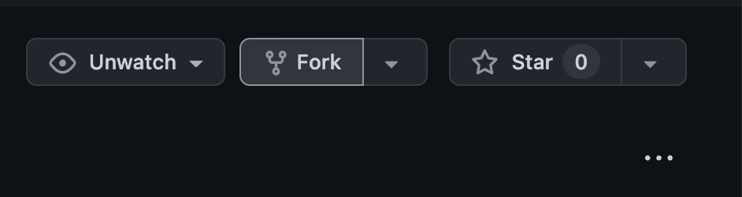
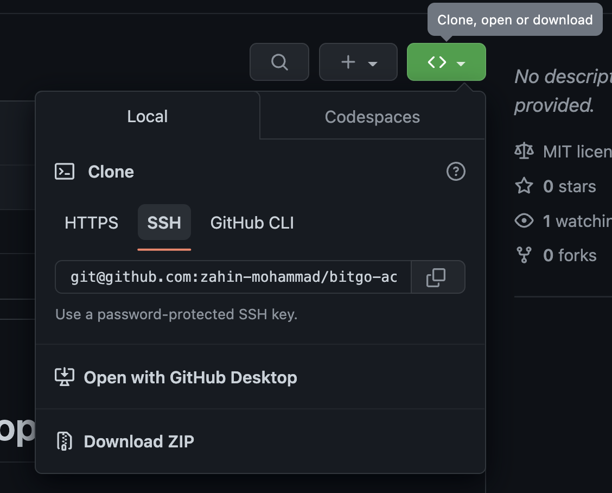

# BitGo Activate Policies Workshop
## Reference
- [BitGo Docs](https://developers.bitgo.com)
## Getting Started
1. Fork the repository to your github account (optional)

2. Clone the repository 

3. Install Dependencies
    - npm >= 6.14.14 (reccomended approach is via [NVM](https://github.com/nvm-sh/nvm))
    - (optional) [Yarn](https://classic.yarnpkg.com/lang/en/docs/install/#mac-stable): `npm install --global yarn`
    - Install packages with `yarn` or `npm install`

## Workshop
### Pre-Requisite
- access to a testnet enterprise
    - have 2 admin users on the enterprise
    - note down the enterpriseId! It will be used later.
- an access token created from 1 admin user
- 